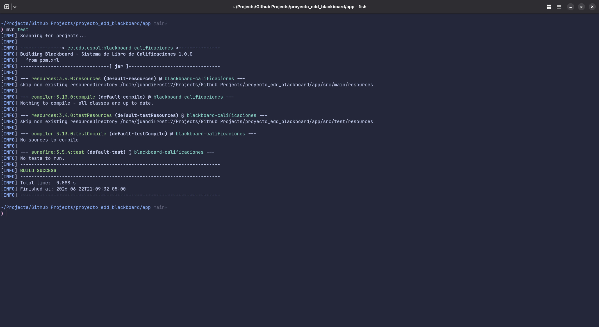
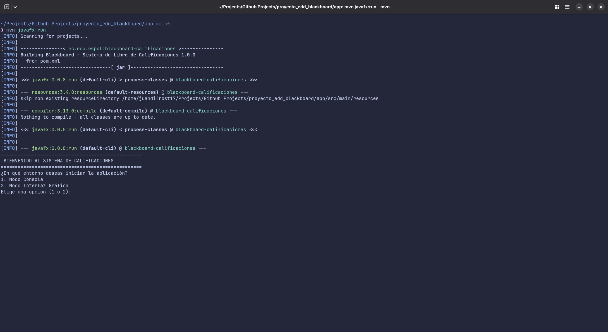
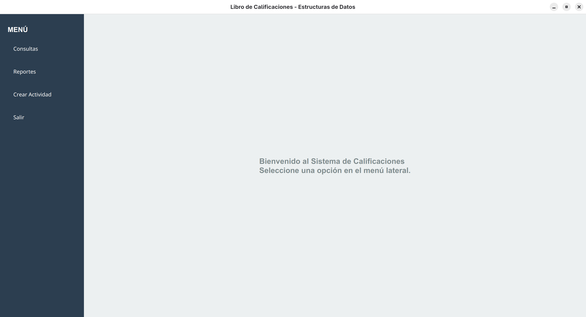
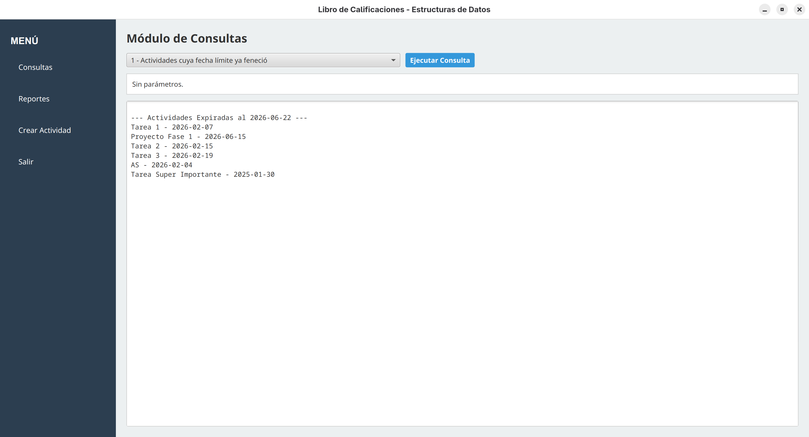
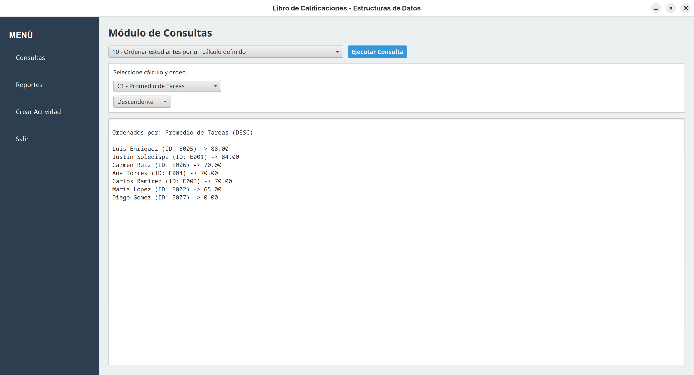
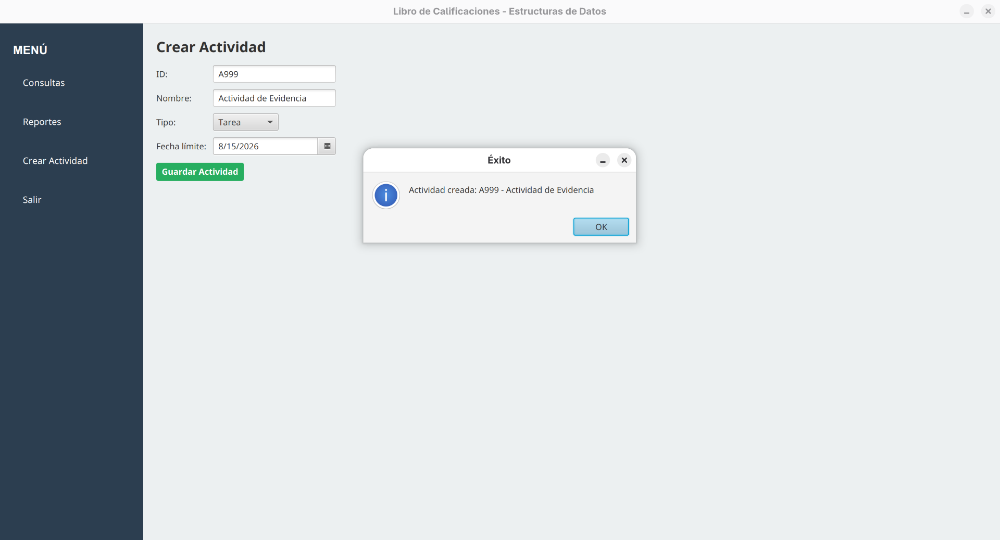
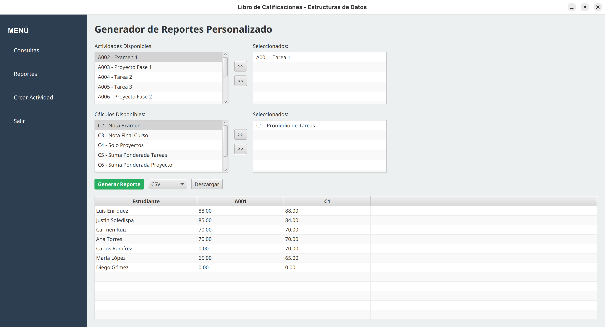
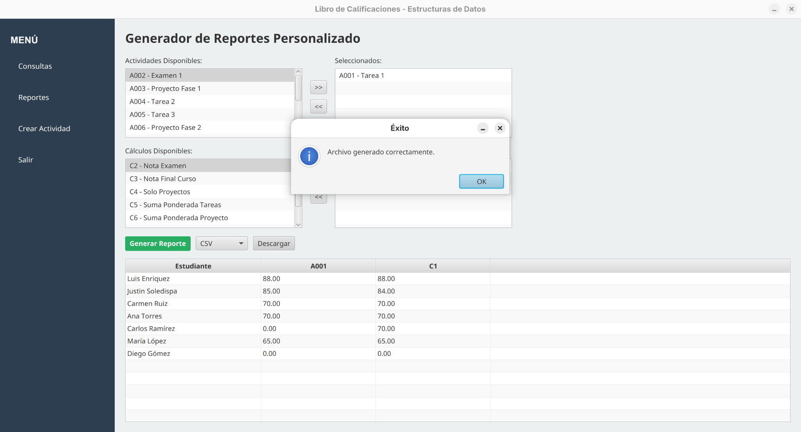
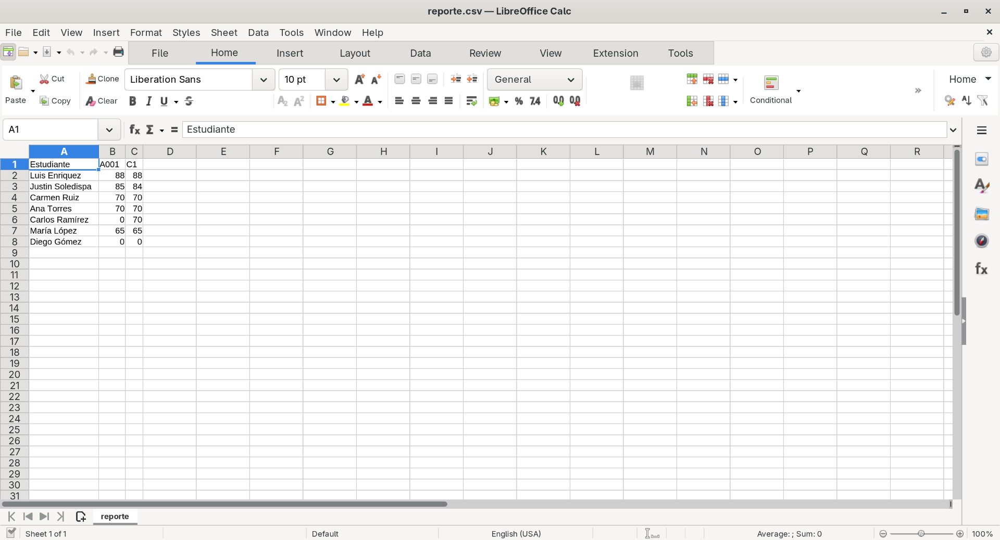

# Blackboard - Sistema de Libro de Calificaciones

**Blackboard** es una aplicación académica desarrollada en Java y JavaFX para gestionar estudiantes, actividades, entregas, cálculos de calificaciones, consultas y reportes. El sistema carga datos desde archivos CSV, los procesa mediante estructuras de datos personalizadas y permite usar la misma lógica desde consola o desde una interfaz gráfica de escritorio.

---

## Descripción

El proyecto simula un libro de calificaciones tipo Blackboard. La aplicación permite registrar actividades, consultar entregas, detectar casos académicos específicos y generar reportes personalizados en formato CSV o TXT.

La solución no usa base de datos. Los datos principales se leen desde archivos CSV ubicados en `app/`, y el procesamiento se realiza en memoria con listas compuestas, nodos genéricos, comparadores y evaluación de fórmulas en notación posfija.

---

## Contexto académico

Este proyecto fue desarrollado como entrega académica para la materia de Estructura de Datos. La implementación aplica conceptos de programación orientada a objetos, manejo de archivos y estructuras de datos propias.

| Requisito | Implementación en Blackboard |
| --- | --- |
| Aplicación de escritorio | Interfaz JavaFX con módulos de consultas, reportes y creación de actividades. |
| Modo consola | Menús textuales para ejecutar consultas, crear actividades y generar reportes. |
| Estructura personalizada | `ListaCompuesta` y `NodoCompuesto` para relacionar estudiantes, actividades y entregas. |
| Manejo de archivos | Carga de estudiantes, actividades, entregas y cálculos desde CSV. |
| Consultas académicas | Búsquedas y filtros sobre entregas, actividades, estudiantes y cálculos. |
| Ordenamiento | Comparadores personalizados mediante `Comparator`. |
| Cálculos de notas | Evaluación de fórmulas en notación posfija usando pila. |
| Reportes | Tabla personalizada exportable a CSV o TXT. |
| Gestión de dependencias | Maven con JavaFX como dependencia principal. |

---

## Integrantes

| Integrante |
| --- |
| Karel González |
| Justin Soledispa |
| Juan Diego Sotomayor |

---

## Distribución modular

| Módulo | Responsabilidad |
| --- | --- |
| Modelo | Representa estudiantes, actividades, entregas y cálculos. |
| Carga de datos | Lee archivos CSV y construye las estructuras en memoria. |
| Estructuras de datos | Implementa listas compuestas y nodos genéricos. |
| Consultas | Ejecuta filtros y búsquedas sobre actividades, entregas y estudiantes. |
| Cálculos | Evalúa fórmulas de calificación en notación posfija. |
| Reportes | Genera tablas de calificaciones y exporta resultados. |
| Comparadores | Ordena actividades, entregas y estudiantes según distintos criterios. |
| Interfaz gráfica | Presenta los módulos principales en JavaFX. |
| Consola | Permite operar el sistema desde menús textuales. |

---

## Flujo general del sistema

1. El usuario ejecuta la clase principal `proyecto.Main`.
2. El sistema permite elegir entre modo consola o modo gráfico.
3. Se cargan los archivos `estudiantes.csv`, `actividades.csv`, `entregas.csv` y `calculos.csv`.
4. `CargadorDatos` crea las estructuras principales en memoria.
5. Las entregas se asocian tanto a estudiantes como a actividades.
6. El usuario ejecuta consultas académicas desde consola o JavaFX.
7. El usuario puede registrar nuevas actividades, que se guardan en `actividades.csv`.
8. El módulo de reportes permite seleccionar actividades y cálculos.
9. El sistema calcula las notas y muestra una tabla por estudiante.
10. El reporte puede exportarse en formato CSV o TXT.

---

## Funcionalidades principales

* Carga de estudiantes desde CSV.
* Carga de actividades académicas desde CSV.
* Carga y asociación de entregas por estudiante y actividad.
* Carga de cálculos de calificación.
* Evaluación de fórmulas en notación posfija.
* Consultas sobre actividades vencidas, entregas incompletas, calificaciones y estudiantes.
* Detección de cálculos que no pueden ejecutarse por falta de notas.
* Ordenamiento de estudiantes según un cálculo definido.
* Creación manual de actividades desde consola o JavaFX.
* Generación de reportes personalizados.
* Exportación de reportes a CSV o TXT.

---

## Consultas disponibles

| Número | Consulta |
| --- | --- |
| 1 | Actividades cuya fecha límite ya feneció. |
| 2 | Actividades con entregas incompletas según cantidad de caracteres. |
| 3 | Actividades con calificaciones menores a un valor dado. |
| 4 | Entregas enviadas después de cierta fecha y aún no calificadas. |
| 5 | Estudiantes con porcentaje de entregas mayor a un valor dado. |
| 6 | Estudiantes que no han respondido actividades vencidas. |
| 7 | Estudiantes que tienen la misma nota en dos actividades diferentes. |
| 8 | Cálculos que no se pueden ejecutar por falta de calificaciones. |
| 9 | Cálculos que involucran una actividad específica. |
| 10 | Ordenamiento de estudiantes según un cálculo definido. |

---

## Stack tecnológico

| Componente | Tecnología usada |
| --- | --- |
| Lenguaje | Java 17+ |
| Interfaz gráfica | JavaFX |
| Gestión de dependencias | Maven |
| Datos | Archivos CSV |
| Reportes | CSV y TXT |
| Paradigma | Programación orientada a objetos |
| Estructuras | Lista compuesta, nodo compuesto y pila |
| IDE sugerido | IntelliJ IDEA |

---

## Estructura del repositorio

```text
proyecto_edd_blackboard/
├── app/
│   ├── pom.xml                         # Configuración Maven del proyecto Java
│   ├── actividades.csv                 # Datos base de actividades
│   ├── calculos.csv                    # Fórmulas en notación posfija
│   ├── entregas.csv                    # Entregas de estudiantes
│   ├── estudiantes.csv                 # Datos de estudiantes
│   ├── reporte_calificaciones.csv      # Ejemplo de reporte generado
│   ├── reporte_calificaciones.txt      # Ejemplo de reporte generado
│   └── src/
│       └── proyecto/
│           ├── *.java                  # Modelos, gestores y estructuras principales
│           ├── comparadores/           # Comparadores personalizados
│           └── interfaz/               # Aplicación JavaFX y módulos visuales
├── capturas/                           # Evidencia visual del funcionamiento
├── csv/                                # Copia de archivos CSV y reportes de apoyo
├── docs/                               # Consigna y documento de diseño
└── README.md                           # Documentación principal del proyecto
```

---

## Archivos CSV

El sistema espera los archivos CSV en el directorio de ejecución. Con Maven, el directorio correcto es `app/`.

| Archivo | Propósito |
| --- | --- |
| `estudiantes.csv` | Registra id, nombre, apellido, edad y correo de cada estudiante. |
| `actividades.csv` | Registra id, nombre, fecha límite y tipo de actividad. |
| `entregas.csv` | Registra entregas, contenido, calificación, fecha y estado de calificación. |
| `calculos.csv` | Registra fórmulas de calificación en notación posfija. |

Ejemplo de fórmula en `calculos.csv`:

```csv
C3,Nota Final Curso,Tarea 0.3 * Proyecto 0.3 * + Examen 0.4 * +
```

---

## Capturas del sistema

Las siguientes capturas se encuentran en la carpeta `capturas/` y documentan el flujo completo: verificación con Maven, arranque de la aplicación, consultas, creación de actividades, reportes y exportación a CSV.

### Configuración y arranque

| Verificación Maven | Selector de modo |
| --- | --- |
|  |  |
| El proyecto compila correctamente con Maven y finaliza con `BUILD SUCCESS`. | La clase `proyecto.Main` se ejecuta desde Maven y permite elegir entre modo consola e interfaz gráfica. |

### Interfaz gráfica



La pantalla inicial carga los datos desde CSV y muestra el menú lateral con acceso a los módulos de consultas, reportes, creación de actividades y salida del sistema.

### Consultas

El módulo de consultas permite ejecutar filtros académicos sobre actividades, entregas, estudiantes y cálculos. En la evidencia se muestran actividades vencidas al `2026-06-22` y el ordenamiento de estudiantes por el cálculo `C1 - Promedio de Tareas`.

| Actividades vencidas | Ordenamiento por cálculo |
| --- | --- |
|  |  |
| El sistema muestra solo las actividades con fecha límite anterior a la fecha actual de referencia. | Los estudiantes se ordenan de forma descendente según el resultado del cálculo de promedio de tareas. |

### Creación de actividades

| Actividad creada |
| --- |
|  |
| Se registra la actividad `A999 - Actividad de Evidencia` como tarea con fecha límite futura. La aplicación confirma el registro y guarda la actividad en `actividades.csv`. |

### Reportes y exportación

El módulo de reportes permite seleccionar actividades y cálculos para construir una tabla de calificaciones por estudiante. En la evidencia se usa la actividad `A001 - Tarea 1` y el cálculo `C1 - Promedio de Tareas`.

| Reporte generado | Exportación confirmada |
| --- | --- |
|  |  |
| La tabla muestra los estudiantes junto con la nota de la actividad seleccionada y el cálculo generado. | La aplicación confirma que el archivo CSV fue generado correctamente. |

| Archivo exportado |
| --- |
|  |
| LibreOffice Calc muestra el archivo `reporte.csv` exportado desde la aplicación, con las columnas `Estudiante`, `A001` y `C1`. |

---

## Reportes generados

El repositorio incluye ejemplos de reportes:

```text
app/reporte_calificaciones.csv
app/reporte_calificaciones.txt
csv/reporte_calificaciones.csv
csv/reporte_calificaciones.txt
```

---

## Video demostrativo

[Ver video en Google Drive](https://drive.google.com/file/d/12ZgtqMgI5R5SIOCqYmEzz3WdIHWyEjGh/view?usp=drivesdk)

---

## Instalación y ejecución

### Prerrequisitos

* JDK 17 o superior.
* Maven.
* Git, si se clona el repositorio.

### Clonar el repositorio

```bash
git clone https://github.com/juandifrost17/proyecto_edd_blackboard.git
cd proyecto_edd_blackboard/app
```

### Verificar compilación con Maven

Desde la carpeta `app`:

```bash
mvn test
```

La verificación debe terminar con:

```text
BUILD SUCCESS
```

### Ejecutar la aplicación

Desde la carpeta `app`:

```bash
mvn javafx:run
```

La aplicación mostrará el selector inicial:

```text
1. Modo Consola
2. Modo Interfaz Gráfica
```

Seleccione `1` para usar menús en terminal o `2` para abrir la interfaz JavaFX.

### Ejecutar desde IntelliJ IDEA

1. Abrir IntelliJ IDEA.
2. Seleccionar `Open` y abrir el archivo `app/pom.xml`.
3. Esperar la importación de Maven.
4. Crear una configuración `Application`.
5. Usar como clase principal `proyecto.Main`.
6. Configurar el directorio de trabajo como `app`.
7. Ejecutar la configuración.
